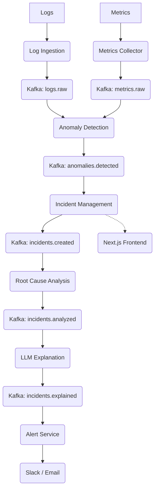

<p align="center">
  
</p>

<h1 align="center">SentinelOps</h1>

<p align="center">
  <strong>The AI-Powered Intelligent Incident Response Platform</strong><br>
  <em>Reimagining site reliability through real-time anomaly detection and LLM-driven diagnostics.</em>
</p>

<p align="center">
  
  
  
  
  
</p>

<p align="center">
  <a href="https://sentinel-ops-psi.vercel.app"><strong>View Live Demo →</strong></a>
</p>

---

## 🚀 Overview
**SentinelOps** is a state-of-the-art AIOps platform designed to automate the entire SRE lifecycle. It acts as an intelligent layer above your infrastructure, ingesting raw logs and metrics to pinpoint anomalies before they become outages. By utilizing Large Language Models (LLMs), SentinelOps doesn't just tell you *that* something is wrong—it explains *why* and tells you how to fix it.

## ✨ Key Features
- **Log Ingestion Pipeline**: Scalable ingestion and standardization of structured and unstructured logs.
- **Metrics Monitoring**: Real-time tracking of system-level performance indicators (CPU, RAM, Latency).
- **AI Anomaly Detection**: Heuristic and statistical processors that flag threshold breaches in real-time.
- **Root Cause Analysis (RCA)**: Automated inference engine that identifies the underlying culprit of system instability.
- **LLM-Based Explanations**: Converts complex technical data into human-readable mitigation strategies using LLMs.
- **Slack / Email Alerting**: Multi-channel dispatch to ensure immediate responder awareness.
- **Observability Dashboard**: Premium Next.js frontend featuring glassmorphism and real-time visualization.

## 🏗️ System Architecture
SentinelOps operates on a highly scalable, event-driven backbone utilizing **Apache Kafka** for asynchronous microservice orchestration.

### Visual Overview


### Data Flow Diagram


## 📂 Project Structure
Each layer of SentinelOps is decoupled for maximum maintainability:

- **`services/`**: The core backend microservices (Python/FastAPI) handling ingestion, detection, and AI logic.
- **`frontend/`**: The premium Next.js incident dashboard with real-time health visualization.
- **`infrastructure/`**: Production-grade configurations for Docker, Kubernetes (planned), and Terraform (planned).
- **`configs/`**: Shared global constants, schema definitions, and environment templates.
- **`ai-models/`**: AI/ML components including heuristic processors and LLM prompt engineering logic.
- **`docs/`**: Deep-dive technical documentation on system architecture and event flow.

## 🧪 Tech Stack
- **Backend**: Python, FastAPI, Pydantic, Uvicorn
- **Messaging**: Apache Kafka, Zookeeper
- **Frontend**: Next.js 14, React, Framer Motion, Tailwind CSS
- **Infrastructure**: Docker, Docker Compose

## ⚡ Running Locally

### 1. Start Support Infrastructure
```bash
cd infrastructure/docker
docker-compose up -d
```

### 2. Boot Microservices
Navigate to `services/<service-name>`, create a virtual environment, install requirements, and run:
```bash
uvicorn src.main:app --port 800X --reload
```

### 3. Launch Dashboard
```bash
cd frontend/incident-dashboard
npm install
npm run dev
```

## 🔮 Future Roadmap
- [ ] **Machine Learning Anomaly Detection**: Integration of Isolation Forests and XGBoost for predictive monitoring.
- [ ] **Prometheus + Grafana**: Native observability stack integration for deep metric exploration.
- [ ] **Kubernetes Deployment**: Production-ready Helm charts and operator-based management.
- [ ] **Distributed Tracing**: Full OpenTelemetry integration across the event pipeline.
- [ ] **GitHub Actions CI/CD**: Automated testing and deployment pipelines for every microservice.

---
<p align="center">
  Built with ❤️ by <a href="https://github.com/Ranjithhub08">Ranjithhub08</a>
</p>
