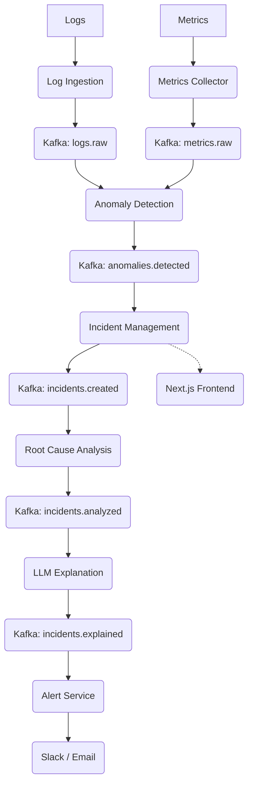

<p align="center">
  
</p>

<h1 align="center">SentinelOps</h1>

<p align="center">
  <strong>The AI-Powered Intelligent Incident Response Platform</strong><br>
  <em>Reimagining site reliability through real-time anomaly detection and LLM-driven diagnostics.</em>
</p>

<p align="center">
  
  
  
  
</p>

<p align="center">
  <a href="https://sentinel-ops-psi.vercel.app"><strong>View Live Demo →</strong></a>
</p>

---

## 🚀 Overview
**SentinelOps** is a state-of-the-art AIOps platform designed to automate the entire SRE lifecycle. It acts as an intelligent layer above your infrastructure, ingesting raw logs and metrics to pinpoint anomalies before they become outages. By utilizing Large Language Models (LLMs), SentinelOps doesn't just tell you *that* something is wrong—it explains *why* and tells you how to fix it.

## ✨ Key Features
- **Log Ingestion Pipeline**: Scalable ingestion and standardization of structured and unstructured logs.
- **Metrics Monitoring**: Real-time tracking of system-level performance indicators (CPU, RAM, Latency).
- **AI Anomaly Detection**: Heuristic and statistical processors that flag threshold breaches in real-time.
- **Root Cause Analysis (RCA)**: Automated inference engine that identifies the underlying culprit of system instability.
- **LLM-Based Explanations**: Converts complex technical data into human-readable mitigation strategies using LLMs.
- **Slack / Email Alerting**: Multi-channel dispatch to ensure immediate responder awareness.
- **Observability Dashboard**: Premium Next.js frontend featuring glassmorphism and real-time visualization.

## 🏗️ System Architecture
SentinelOps operates on a highly scalable, event-driven backbone utilizing **Apache Kafka** for asynchronous microservice orchestration.



## 🛠️ Microservices
SentinelOps is composed of 7 independent microservices:
*   `log-ingestion-service`: Standardizes and publishes log telemetry.
*   `metrics-collector-service`: Collects and standardizes performance metrics.
*   `anomaly-detection-service`: Processes raw telemetry to flag threshold violations.
*   `incident-management-service`: Aggregates anomalies into trackable system incidents.
*   `root-cause-analysis-service`: Applies AI logic to identify failure origins.
*   `llm-explanation-service`: Generates human-readable remediation context.
*   `alert-service`: Dispatches notifications to external integrations.

## 🧪 Tech Stack
| Category | Technologies |
| :--- | :--- |
| **Backend** | Python, FastAPI, Pydantic, Uvicorn |
| **Messaging** | Apache Kafka, Zookeeper |
| **Frontend** | Next.js 14, React, Framer Motion, Tailwind CSS |
| **Infrastructure** | Docker, Kubernetes (Planned), Terraform (Planned) |

## 📂 Project Structure
```text
/
├── services/               # Backend microservices logic (Python/FastAPI)
├── frontend/               # Premium Next.js dashboard
├── infrastructure/         # Docker, Kubernetes, and Terraform configs
├── configs/                # Shared global constants and configurations
├── ai-models/              # AI/ML logic and model components
└── docs/                   # Extended system documentation
```

## ⚡ Running Locally

### 1. Start Support Infrastructure
```bash
cd infrastructure/docker
docker-compose up -d
```

### 2. Boot Microservices
Navigate to `services/<service-name>`, create a virtual environment, install requirements, and run:
```bash
uvicorn src.main:app --port 800X --reload
```

### 3. Launch Dashboard
```bash
cd frontend/incident-dashboard
npm install
npm run dev
```

## 🔮 Future Improvements
- [ ] **Machine Learning RCA**: Moving from heuristics to Isolation Forests and XGBoost.
- [ ] **Observability Stack**: Native integration with Prometheus and Grafana.
- [ ] **Cloud Native**: Full Kubernetes Helm charts and Terraform provisioning scripts.
- [ ] **Tracing**: Distributed tracing integration with OpenTelemetry.
- [ ] **CI/CD**: Automated deployment pipelines for each microservice.

---
<p align="center">
  Built with ❤️ by <a href="https://github.com/Ranjithhub08">Ranjithhub08</a>
</p>
