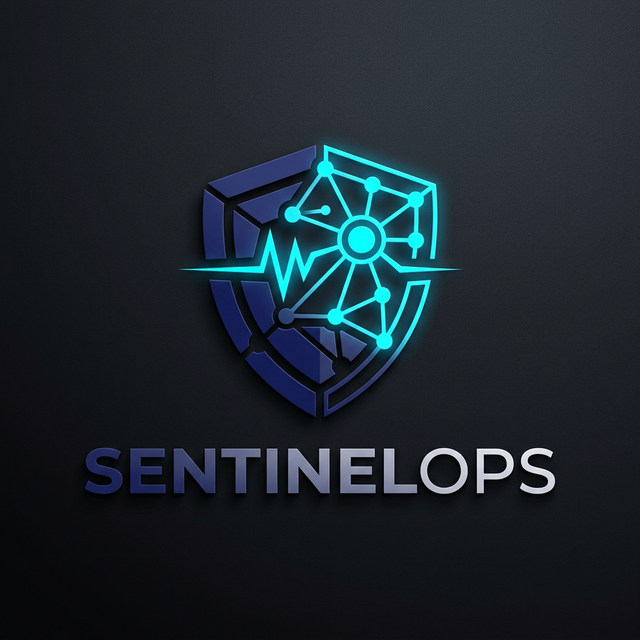
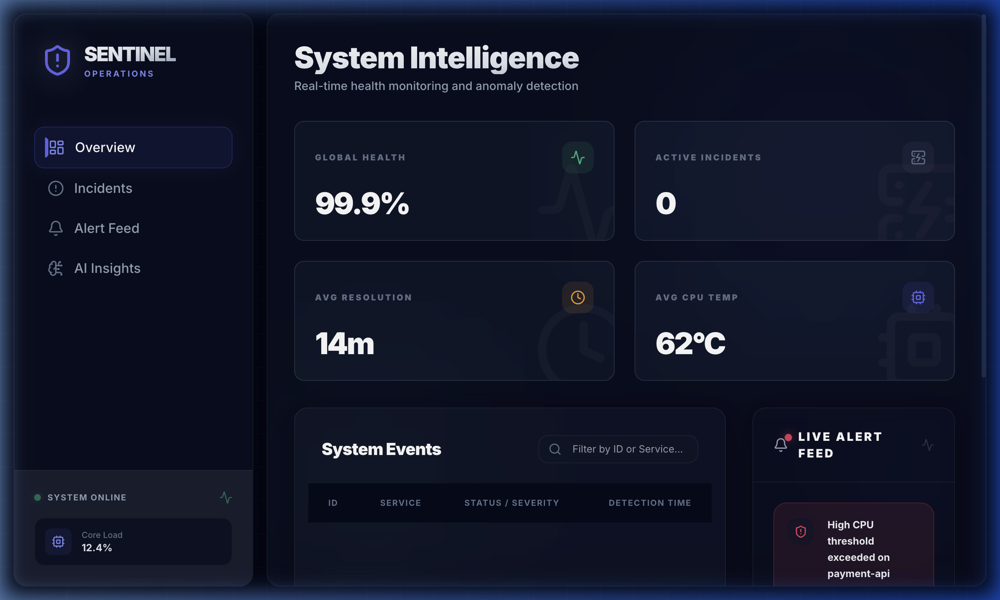
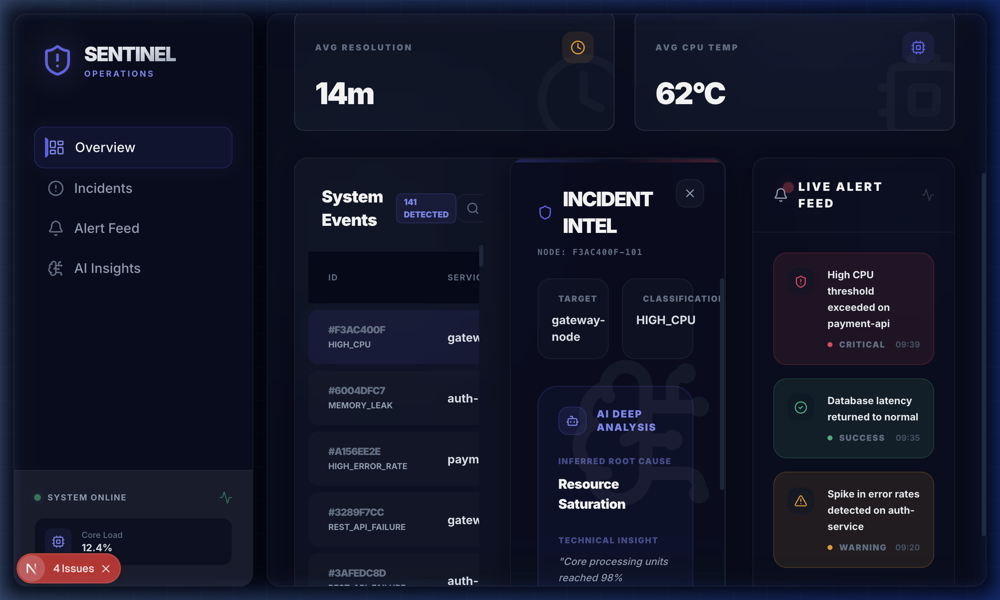
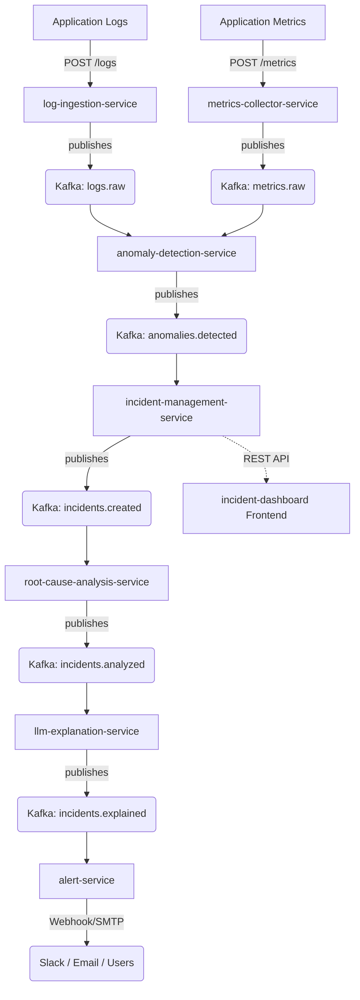

<p align="center">
  
</p>

<h1 align="center">SentinelOps</h1>

<p align="center">
  <strong>The AI-Powered Intelligent Incident Response Platform</strong><br>
  <em>Reimagining site reliability through real-time anomaly detection and LLM-driven diagnostics.</em>
</p>

<p align="center">
  
  
  
  
</p>

<p align="center">
  <a href="https://sentinel-ops-psi.vercel.app"><strong>View Live Demo →</strong></a>
</p>

---

## 🚀 Overview
**SentinelOps** is a state-of-the-art incident intelligence engine designed to automate the entire SRE lifecycle. By bridging the gap between raw system telemetry and human-readable insights, SentinelOps ensures that your team spends less time debugging and more time building.

### ✨ The "Fire" UI Experience
We've overhauled the dashboard with a premium, command-center aesthetic:
- **Advanced Glassmorphism**: Translucent panels with refined backdrop blurs.
- **Dynamic Animations**: Coordinated page transitions and staggered row entries via `framer-motion`.
- **Intelligent Hub**: A sidebar-driven layout providing instant access to AI-generated root cause analysis.



## 📡 Live Intelligence Hub
Observe real-time system behavior and AI diagnostics in action. When a threshold is breached, the **Incident Intel** panel provides deep technical context and remediation strategies automatically.



## 🏗️ System Architecture
SentinelOps operates on a highly scalable, event-driven backbone utilizing **Apache Kafka** for asynchronous microservice orchestration.



## 🛠️ Tech Stack
| Layer | Technologies |
| :--- | :--- |
| **Frontend** | Next.js 14, React, Framer Motion, Tailwind CSS, Lucide |
| **Backend** | Python 3.9+, FastAPI, Pydantic, Uvicorn |
| **Messaging** | Apache Kafka, Zookeeper |
| **Infrastructure** | Docker, Docker Compose, Terraform (Upcoming) |
| **AI/ML** | Rule-based RCA, LLM Integration (DeepMind/Gemini) |

## ⚡ Quick Start

### 1. Prerequisites
- Docker & Docker Compose
- Node.js 18+
- Python 3.9+

### 2. Launch Local Environment
We provide an automated script to boot the entire ecosystem:
```bash
# Start Kafka, Zookeeper, and all 7 microservices
chmod +x start_test_env.sh
./start_test_env.sh
```

### 3. Open the Dashboard
Once the services are active, the dashboard will be available at:
- **Local**: `http://localhost:3000`
- **Demo**: [https://sentinel-ops-psi.vercel.app](https://sentinel-ops-psi.vercel.app)

## 📂 Project Structure
```text
/
├── services/               # 7 Backend microservices (Python/FastAPI)
├── frontend/               # Premium Next.js incident dashboard
├── infrastructure/         # Docker-Compose and Cloud manifests
├── configs/                # Shared global states and environment templates
├── ai-models/              # ML components and logic
└── assets/                 # Brand identity and media
```

---
<p align="center">
  Built with ❤️ for SREs by <a href="https://github.com/Ranjithhub08">Ranjithhub08</a>
</p>
