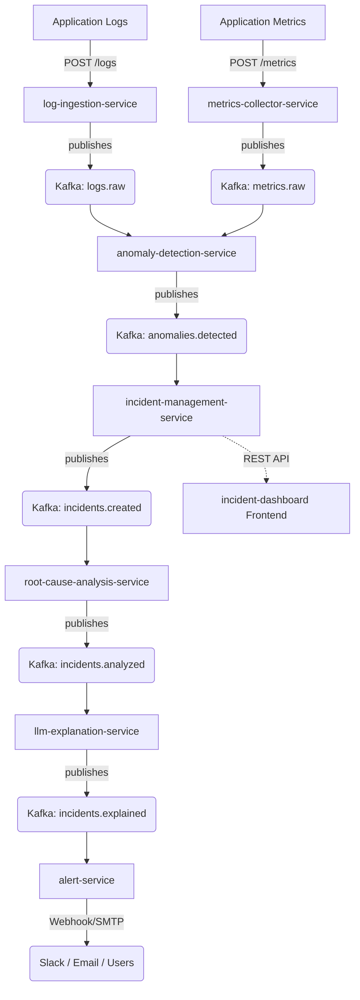

# SentinelOps

**AI-Powered Intelligent Incident Response Platform**

## Overview
SentinelOps is a modern, distributed Incident Intelligence Platform that completely re-imagines how site reliability engineers scale their operations. It automatically ingests raw logs and metrics, detects anomalies using real-time heuristics, infers system root causes, generates human-readable incident explanations via Large Language Models (LLMs), and routes targeted alerts to responders.

## Key Features
- **Real-Time Telemetry Ingestion**: Scalable ingestion of structured logs and application metrics.
- **Automated Anomaly Detection**: Edge heuristics and anomaly processors dynamically flag threshold breaches.
- **Incident Lifecycle Management**: Stateful aggregation of anomalies into trackable incidents.
- **AI-Driven Root Cause Analysis (RCA)**: Automated inference engines identifying the underlying culprits of instability.
- **Natural Language Explanations**: LLM-powered context generation converting technical data into human-readable mitigation strategies.
- **Multi-Channel Alerting**: Direct dispatch to Slack, Email, and internal audit logs.
- **Observability Dashboard**: Next.js and TailwindCSS-powered frontend featuring glassmorphism aesthetics and live views of system health.

## System Architecture

SentinelOps relies on an event-driven microservices architecture communicating asynchronously over Apache Kafka.



## Microservices
Each component is designed with a single responsibility, enabling independent scaling and isolated failure domains:
* `log-ingestion-service`: Standardizes log telemetry.
* `metrics-collector-service`: Collects performance metrics.
* `anomaly-detection-service`: Subscribes to telemetry topics and flags heuristic violations.
* `incident-management-service`: Promotes raw anomalies to actionable incidents via REST APIs.
* `root-cause-analysis-service`: Applies rule-based AI reasoning to detect root causes.
* `llm-explanation-service`: Generates plain-text remediation strategies.
* `alert-service`: Handles notification dispatch.

## Tech Stack
* **Backend**: Python 3.9+, FastAPI, Pydantic, Uvicorn
* **Event Broker**: Apache Kafka (kafka-python), Zookeeper
* **Frontend**: Next.js 14, React, TailwindCSS, Lucide Icons
* **Infrastructure**: Docker, Docker Compose

## Project Structure

```text
/
├── services/               # Backend microservices logic
├── frontend/               # Next.js incident dashboard
├── infrastructure/         # Docker, Kubernetes, Terraform configs
├── configs/                # Shared global configuration states
├── ai-models/              # AI components and ML/LLM model weights
└── docs/                   # Architecture and technical documentation
```

## Running Locally

1. **Start the Event Backbone**:
   Navigate to the docker directory and spin up Kafka/Zookeeper.
   ```bash
   cd infrastructure/docker
   docker-compose up -d
   ```

2. **Boot the Backend Services**:
   Follow the `README.md` within each `services/*` directory to initialize virtual environments, install `requirements.txt`, and run the FastAPI uvicorn server.

3. **Launch the Dashboard**:
   Navigate to the frontend directory to start the UI.
   ```bash
   cd frontend/incident-dashboard
   npm install
   npm run dev
   ```

## Future Improvements
- Migration from heuristic RCA to an embedded ML model (XGBoost/Isolation Forests).
- Integration with live OpenAI/Anthropic APIs for the `llm-explanation-service`.
- Expansion of the Kubernetes manifest structure for cloud-native deployment.
- Implementation of a persistent database layer (PostgreSQL) in place of the incident in-memory store.
