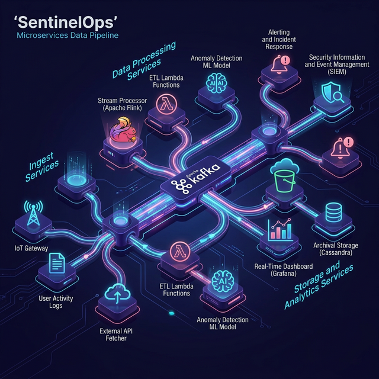
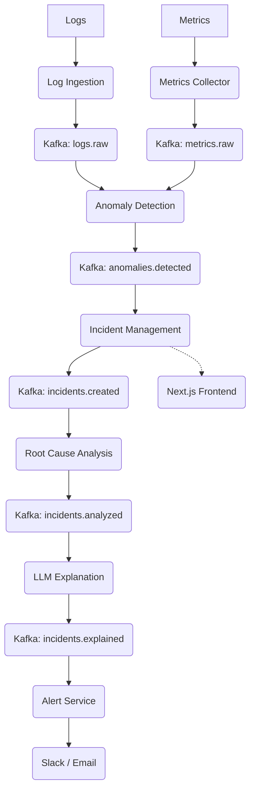

<p align="center">
  
</p>

<h1 align="center">SentinelOps</h1>

<p align="center">
  <strong>The AI-Powered Intelligent Incident Response Platform</strong><br>
  <em>Reimagining site reliability through real-time anomaly detection and LLM-driven diagnostics.</em>
</p>

<p align="center">
  
  
  
  
  
</p>

<p align="center">
  <a href="https://sentinel-ops-psi.vercel.app"><strong>View Live Demo →</strong></a>
</p>

---

## 🚀 Overview
**SentinelOps** is a state-of-the-art AIOps platform designed to automate the entire SRE lifecycle. It acts as an intelligent layer above your infrastructure, ingesting raw logs and metrics to pinpoint anomalies before they become outages. By utilizing Large Language Models (LLMs), SentinelOps doesn't just tell you *that* something is wrong—it explains *why* and tells you how to fix it.

## 📄 Resume Description
SentinelOps is a distributed microservices platform designed for automated incident detection and response. It leverages an event-driven Kafka pipeline to ingest logs and metrics in real time, apply AI-assisted root cause analysis, and serve intelligent alerts via a Next.js observability dashboard.

## 🧠 Engineering Concepts Demonstrated
This project serves as a comprehensive portfolio piece demonstrating:
- Microservices Architecture
- Event-Driven Systems
- Distributed System Design
- Observability & Incident Management
- AI-assisted Root Cause Analysis

## ✨ Key Features
* Log ingestion pipeline
* Metrics monitoring
* AI anomaly detection
* Root cause analysis
* LLM-generated explanations
* Slack / Email alerting
* Observability dashboard

## 🏗️ System Architecture
SentinelOps operates on a highly scalable, event-driven backbone utilizing **Apache Kafka** for asynchronous microservice orchestration.

### Visual Overview


### Data Flow Diagram


## 📂 Project Structure
Each layer of SentinelOps is decoupled for maximum maintainability:

- **`services/`** → backend microservices
- **`frontend/`** → Next.js dashboard
- **`infrastructure/`** → Docker / Kubernetes / Terraform configs
- **`configs/`** → shared configuration
- **`ai-models/`** → AI components
- **`docs/`** → architecture documentation

## 🧪 Tech Stack
- **Backend**: Python, FastAPI, Pydantic, Uvicorn
- **Messaging**: Apache Kafka, Zookeeper
- **Frontend**: Next.js 14, React, Framer Motion, Tailwind CSS
- **Infrastructure**: Docker, Docker Compose

## ⚡ Running Locally

### 1. Start Support Infrastructure
```bash
cd infrastructure/docker
docker-compose up -d
```

### 2. Boot Microservices
Navigate to `services/<service-name>`, create a virtual environment, install requirements, and run:
```bash
uvicorn src.main:app --port 800X --reload
```

### 3. Launch Dashboard
```bash
cd frontend/incident-dashboard
npm install
npm run dev
```

## 📊 Monitoring

SentinelOps includes a pre-configured monitoring stack using **Prometheus** and **Grafana**:
- **Prometheus**: Scrapes metrics from `log-ingestion-service`, `metrics-collector-service`, `anomaly-detection-service`, and `incident-management-service`.
- **Grafana**: Provides a visual dashboard for monitoring service health and metrics. Configuration is located in `infrastructure/monitoring/`.

## ⚙️ CI/CD

A robust Continuous Integration and Deployment pipeline is implemented using **GitHub Actions** (`.github/workflows/ci.yml`). The pipeline ensures:
- Automated dependency installation for all services.
- Code quality checks via `flake8` linting.
- Automated test execution.
- Docker image builds for the frontend and microservices.

## 🛳️ Kubernetes Deployment

SentinelOps is built for cloud-native orchestration. Kubernetes manifests are provided in `infrastructure/kubernetes/` for key services:
- `log-ingestion-service`
- `metrics-collector-service`
- `anomaly-detection-service`
- `incident-management-service`

Each service is defined with a `deployment.yaml` for self-healing scaling and a `service.yaml` for cluster-internal discovery.

## 🔮 Future Roadmap
- Prometheus monitoring
- Grafana dashboards
- Kubernetes deployment
- Distributed tracing
- CI/CD pipeline with GitHub Actions

---
<p align="center">
  Built with ❤️ by <a href="https://github.com/Ranjithhub08">Ranjithhub08</a>
</p>
